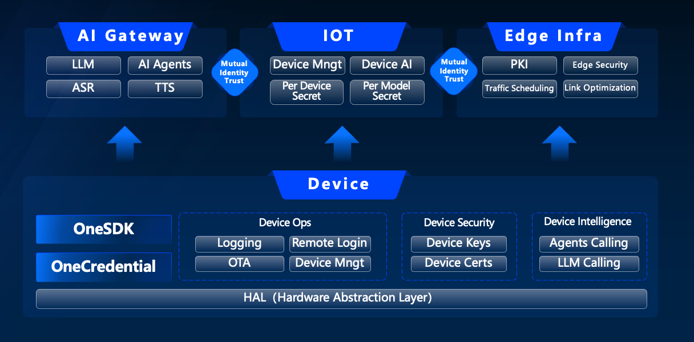

English | [中文README](README.zh_CN.md)

<h1 align="center">OneSDK: A Unified AI Access SDK for the Client-side</h1>

## Table of Contents

- [Table of Contents](#table-of-contents)
- [Introduction](#introduction)
- [Features](#features)
  - [Overall Architecture](#overall-architecture)
  - [Feature List](#feature-list)
- [Quick Start](#quick-start)
  - [Prerequisites](#prerequisites)
  - [Installation, Compilation, and Execution](#installation-compilation-and-execution)
- [Contribution](#contribution)
- [Code of Conduct](#code-of-conduct)
- [Security](#security)
- [License](#license)

## Introduction

OneSDK is an integrated development kit for AI applications on the client-side. It provides large language model (LLM) capabilities including voice conversations, text chats, and agents. It also offers device management, supporting interaction with IoT platforms via the MQTT protocol. The SDK is based on libwebsockets to implement protocols like HTTP, WebSocket, and MQTT. It runs on embedded platforms such as Espressif ESP32, FreeRTOS, and uc-OS2, as well as general-purpose platforms like Linux, macOS, and Windows.

## Features

### Overall Architecture


### Feature List
- **Device Intelligence**
  - **Text Chat**: Supports large model text chat (both streaming and non-streaming).
  - **Image Generation**: Supports large model image recognition and text-to-image generation.
  - **Voice Chat Agent**: Supports various voice chat agents, integrated with Realtime (WebSocket) API.
- **Device Operations**
  - **OTA Upgrade Support**
    - Full package upgrade
    - Differential package upgrade
  - **Device Management**
    - **Token Quota**: Check current quota usage from the cloud console.
  - **SSH**: Supports SSH connections from the console.
  - **Logging**: Supports uploading device operation logs.
- **Device Security**
  - Supports device-side identity authentication with "one key per device" and "one key per product type".
  - Supports device certificates.

## Quick Start

### Prerequisites

**CMake Version Requirement:**
- **Minimum**: CMake 3.10
- **Recommended**: CMake 3.26.x
- **Incompatible**: CMake 4.x (may cause cJSON compatibility issues)

For detailed CMake installation instructions, see [CMake Version Requirements](docs/cmake_version_requirements.md).

**Quick Version Check:**
```bash
# Linux/macOS
./scripts/check_cmake_version.sh

# Windows PowerShell
.\scripts\check_cmake_version.ps1
```

Supported Platforms:
- Espressif ESP32
- RTOS (FreeRTOS/uc-OS2)
- Linux (amd64/arm64)
- macOS (Apple Silicon/Intel)
- Windows (x64/x86)

### Installation, Compilation, and Execution

#### Linux/macOS
Refer to the [Development Guide](docs/develop.md) for instructions on building, compiling, and running.

#### Windows
Refer to the [Windows Development Guide](docs/develop_windows.md) for detailed Windows-specific setup and build instructions.

**Quick Windows Build:**
```cmd
# Clone the repository
git clone --recursive https://github.com/volcengine/onesdk.git
cd onesdk

# Build using Visual Studio (recommended)
build.bat

# Or build using MinGW-w64
mkdir build
cd build
cmake -G "MinGW Makefiles" ..
mingw32-make
```

## Contribution

Please check [Contributing](CONTRIBUTING.md) for more details.

## Code of Conduct

Please check [Code of Conduct](CODE_OF_CONDUCT.md) for more details.

## Security

If you discover a potential security issue in this project, or think you may
have discovered a security issue, we ask that you notify Bytedance Security via our [security center](https://security.bytedance.com/src) or [vulnerability reporting email](sec@bytedance.com).

Please do **not** create a public GitHub issue.

## License

This project is licensed under the [Apache-2.0 License](LICENSE.txt).

# Windows 跨平台适配说明

- 本项目已适配 Windows 平台，所有 POSIX 相关接口（如 `gettimeofday`、`timezone`、`strtok_r`、`localtime_r`、`gmtime_r`、原子操作等）均已在 `include/platform_compat.h` 中做了兼容实现。
- 示例代码中的线程相关接口已兼容 Windows 线程 API。
- 默认关闭示例编译（`ONESDK_WITH_EXAMPLE=OFF`），如需编译请确保 OpenSSL 已正确安装并配置环境变量。
- 主库编译不依赖 OpenSSL，示例如需 TLS/SSL 功能请手动安装 OpenSSL。

## 依赖说明
- Windows 下无需 `sys/time.h`、`pthread.h`，相关功能已在 `platform_compat.h` 里做了兼容。
- 主库不再强制依赖 OpenSSL，示例如需 TLS/SSL 功能需自行安装 OpenSSL 并配置环境变量 `OPENSSL_ROOT_DIR`。

## 编译环境
- 推荐使用 Visual Studio 2019/2022 + CMake 3.10+。
- 需要安装 Windows SDK。
- 如需编译示例，建议安装 OpenSSL。

## 常见问题
- 遇到 `sys/time.h`、`pthread.h`、`openssl/ssl.h` 找不到时，请确认已正确配置依赖或关闭相关功能。
- 如何切换/关闭 TLS 支持（CMake 选项 `LWS_WITH_TLS`）。
- 如何在 Windows 下配置 OpenSSL 环境变量。

---