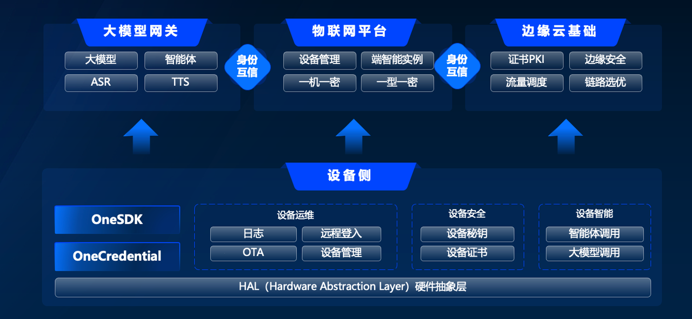

[English](README.md) | 中文README

<h1 align="center">OneSDK: 面向端侧提供的统一AI接入SDK</h1>


## 目录

- [目录](#目录)
- [项目介绍](#项目介绍)
- [功能特性](#功能特性)
  - [整体架构](#整体架构)
  - [功能清单](#功能清单)
- [快速开始](#快速开始)
  - [前提条件](#前提条件)
  - [安装、编译、运行](#安装编译运行)
- [贡献](#贡献)
- [开源协议](#开源协议)
- [安全漏洞](#安全漏洞)

## 项目介绍

OneSDK是一个面向AI应用的端侧集成开发套件，提供包括大模型语音对话、文本对话、智能体等大模型LLM能力，同时也提供设备管理，支持通过MQTT协议与物联网平台进行交互。SDK基于libwebsockets实现HTTP，Websocket，MQTT等协议，支持在嵌入式平台，如乐鑫ESP32，FreeRTOS，uc-OS2等，也支持在通用平台如Linux、MacOS、Windows等平台上运行。


## 功能特性

### 整体架构


### 功能清单
- 设备智能
  - 文本对话：支持大模型文本对话（包含stream和非stream）
  - 图片生成：支持大模型图片识别、文生图
  - 语音对话智能体：支持多种语音对话智能体，集成Realtime实时（WebSocket）API
- 设备运维
  - OTA升级支持
    - 全包升级
    - 差分包升级
  - 设备管理
    - Token配额：可从云控制台查询当前配额使用情况
  - SSH: 支持控制台ssh链接
  - 日志: 支持设备操作日志上传
- 设备安全
  - 支持设备端"一机一秘钥"与"一型一秘钥"身份认证
  - 支持设备证书

## 快速开始

### 前提条件

**CMake版本要求：**
- **最低版本**: CMake 3.10
- **推荐版本**: CMake 3.26.x
- **不兼容版本**: CMake 4.x（可能导致cJSON兼容性问题）

详细的CMake安装说明请参考 [CMake版本要求](docs/cmake_version_requirements.zh_CN.md)。

**快速版本检查：**
```bash
# Linux/macOS
./scripts/check_cmake_version.sh

# Windows PowerShell
.\scripts\check_cmake_version.ps1
```

支持平台：
- 乐鑫ESP32
- RTOS(freertos/uc-OS2)
- Linux（amd64/arm64)
- MacOS(apple silicon/intel)
- Windows (x64/x86)

### 安装、编译、运行

#### Linux/MacOS
参考 [开发指导](docs/develop.zh_CN.md)

#### Windows
参考 [Windows开发指导](docs/develop_windows.md) 获取详细的Windows环境搭建和构建说明。

**Windows快速构建：**
```cmd
# 克隆仓库
git clone --recursive https://github.com/volcengine/onesdk.git
cd onesdk

# 使用Visual Studio构建（推荐）
build.bat

# 或使用MinGW-w64构建
mkdir build
cd build
cmake -G "MinGW Makefiles" ..
mingw32-make
```

Note:
对于中文商业化客户，建议参考 [边缘智能-OneSDK集成说明](https://bytedance.larkoffice.com/wiki/VlHsw5p76i1iSUkOcXJclg4Nnaf#share-TewzdIpI5o5BisxAW2HcKJfBnSc) 构建编译和运行


## 贡献

请查看[Contributing](CONTRIBUTING.md) 获取更多细节。

## 开源协议

本项目采用[Apache-2.0 License](LICENSE.txt)协议.

## 安全漏洞

如果你在此项目中发现了一个潜在的安全问题，请联系[字节跳动安全中心](https://security.bytedance.com/src) 或发送邮件到[漏洞汇报](sec@bytedance.com).

请**不要**创建公开的Github issue.


