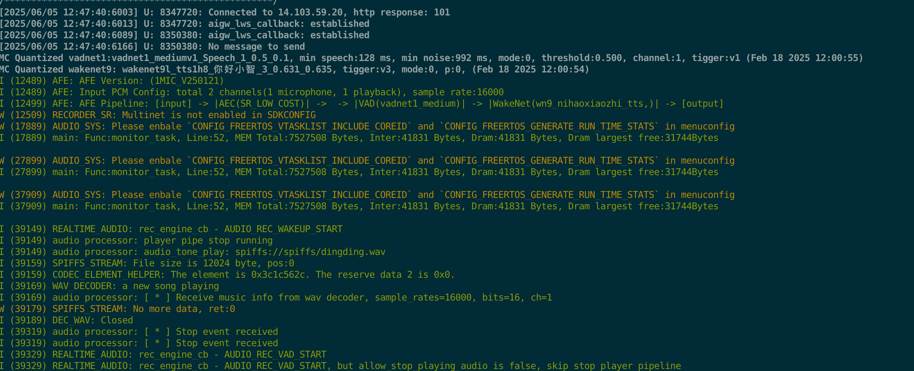

# AtomS3R/AtomS3R-CAM/AtomS3R-M12 + Echo Base

## 简介

<div align="center">
    <a href="https://docs.m5stack.com/zh_CN/core/AtomS3R"><b> AtomS3R 产品主页 </b></a>
    |
    <a href="https://docs.m5stack.com/zh_CN/core/AtomS3R%20Cam"><b> AtomS3R CAM 产品主页 </b></a>
    |
    <a href="https://docs.m5stack.com/zh_CN/core/AtomS3R-M12"><b> AtomS3R M12 产品主页 </b></a>
    |
    <a href="https://docs.m5stack.com/zh_CN/atom/Atomic%20Echo%20Base"><b> Echo Base 产品主页 </b></a>
</div>

- AtomS3R/AtomS3R-CAM/AtomS3R-M12 是 M5Stack 推出的基于 ESP32-S3-PICO-1-N8R8 的物联网可编程控制器，其中AtomS3R搭载tft屏幕，可以使用语音唤醒。AtomS3R-CAM/AtomS3R-M12搭载了摄像头，可实现物体识别和追踪。
- Atomic Echo Base 是一款专为 M5 Atom 系列主机设计的语音识别底座，采用了 ES8311 单声道音频解码器、MEMS 麦克风和 NS4150B 功率放大器的集成方案。

- AtomS3R-CAM/AtomS3R-M12两款开发版均**不带屏幕、不带额外按键**，需要使用语音唤醒。必要时，需要使用 `idf.py monitor` 查看 log 以确定运行状态。

## 配置、编译命令

**首次编译本example时必须**

> [!IMPORTANT]
> 首次运行时，需要将onesdk和libwebsockets等相关依赖链接或者拷贝到当前目录下
> 所以，需要在项目的**根目录**下执行如下命令

```bash
bash build.sh -DONESDK_EXTRACT_SRC=ON
bash scripts/copy_onesdk_src.sh

# 确保目录下存在相关文件内容
ls -l examples/onesdk_esp32_audio
total 48
-rw-r--r--@  1 bytedance  wheel  2385  6 25 19:45 CMakeLists.txt
drwxr-xr-x@  3 bytedance  wheel    96  6 25 19:50 components
-rw-r--r--@  1 bytedance  wheel  1861  6 25 19:45 libwebsockes-diff.diff
drwxr-xr-x@ 32 bytedance  wheel  1024  6 25 19:50 libwebsockets
drwxr-xr-x@ 11 bytedance  wheel   352  6 25 19:45 main
-rw-r--r--@  1 bytedance  wheel   311  6 25 19:45 partitions_example.csv
-rw-r--r--@  1 bytedance  wheel  2424  6 25 19:45 README.md
-rw-r--r--@  1 bytedance  wheel   714  6 25 19:45 sdkconfig.defaults
-rw-r--r--@  1 bytedance  wheel   709  6 25 19:45 sdkconfig.defaults.esp32s3

```
> [!IMPORTANT]
> 以下操作均在**当前文件夹(examples/onesdk_esp32_audio)**下执行

> 以下操作均在当前文件夹下执行

**启用ESP环境变量**

[第四步：设置环境变量](https://docs.espressif.com/projects/esp-idf/zh_CN/stable/esp32/get-started/linux-macos-setup.html#get-started-set-up-env)


**配置编译目标为 ESP32S3**


```bash
idf.py set-target esp32s3
```

**打开 menuconfig 并配置**

```bash
idf.py menuconfig
```

分别配置如下选项：
- `Component config` → `ESP System Settings` → `Main task stack size` → 输入 `35840`
- `Partition Table` → `Custom partition table CSV` → 选择 `AtomS3R CAM/M12 + Echo Base`
- `Partition Table` → `Custom partition CSV file` → 删除原有内容，输入 `partitions.csv`
- `Serial flasher config` → `Flash size` → 选择 `8 MB`
- `Component config` → `ESP PSRAM` → `Support for external, SPI-connected RAM` → `SPI RAM config` → `Mode (QUAD/OCT)` → `Octal Mode PSRAM`
- `Component config` → `FreeRTOS` → `Kernel` 选中 `configENABLE_BACKWARD_COMPATIBILITY`

再配置语音和vad相关选项：
- `Audio HAL` → `Audio board` → 选择 `M5STACK-ATOMS3R`
- `Example Configuration` → `Conversion Mode` → 选择 `LANGUAGE-WAKEUP-MODE`
- `ESP Speech Recognition` → `Load Multiple Wake Words` -> 选择任意唤醒词（以“你好小智”为例）
按 `S` 保存，按 `Q` 退出。

**设置联网**
修改目录下`config.h"`文件，设置`CONFIG_WIFI_SSID`和`CONFIG_WIFI_PASSWORD`
**编译**

```bash
idf.py build
```

**烧录**

将 AtomS3R/CAM/M12 连接到电脑，按住侧面 RESET 按键，直到 RESET 按键下方绿灯闪烁。

```bash
idf.py flash
```

烧录完毕后，按一下 RESET 按钮重启。

**开始对话**

以上面的`你好小智`为例，说出`你好小智`，即可开始对话。

运行日志如下图所示：
